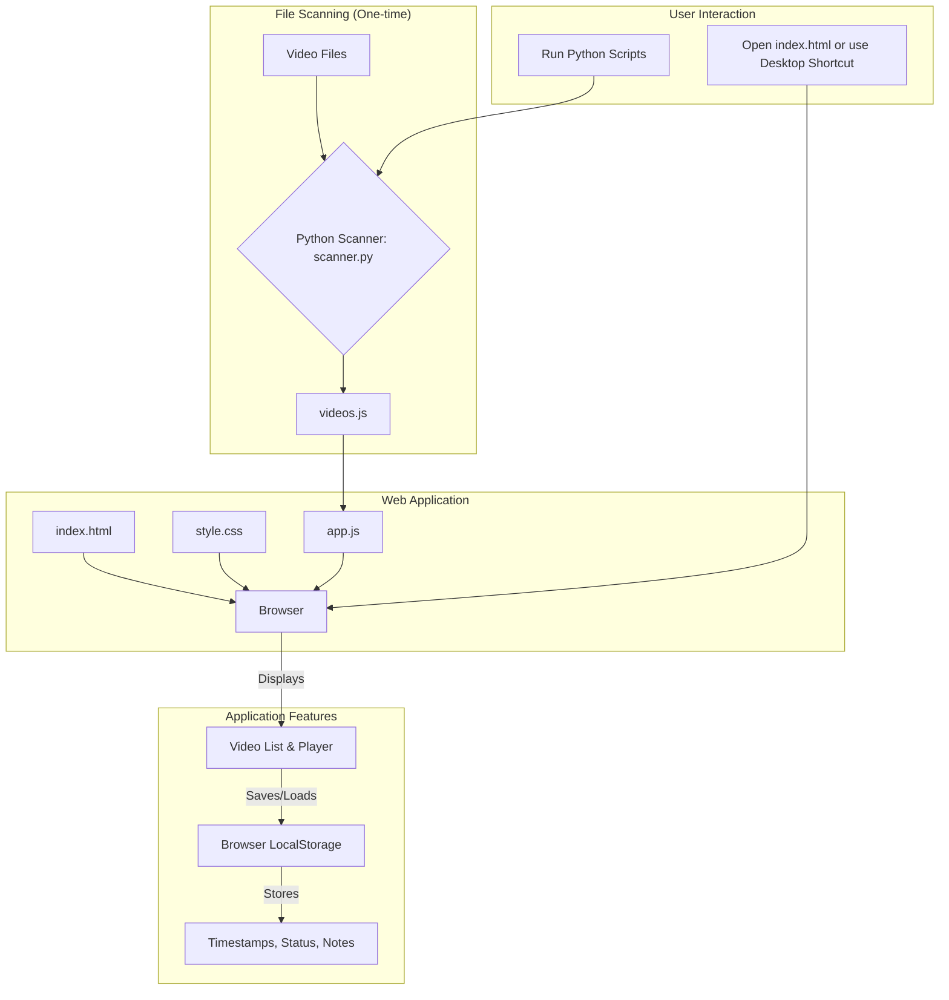

# Local Video Course Bookmarker

A simple, local web-based application to scan your video courses and track your progress. This tool is designed for users who have collections of video tutorials on their local machine and want a simple way to manage where they left off, their status, and any notes.

The application runs entirely on your local machine, requiring no internet connection after the initial setup. All data is stored locally in your browser.

## Features

-   **Local First**: No need to upload your files anywhere. The app runs directly on your machine.
-   **Automatic Scanning**: A Python script scans your specified directory to find all `.mp4` files and organizes them by their parent folder.
-   **Progress Tracking**: For each video, you can track:
    -   **Timestamp Bookmarks**: Save your exact position in a video.
    -   **Status**: Mark videos as "To Watch", "Watching", or "Completed".
    -   **Notes**: Keep notes for each video.
-   **Persistent Storage**: All your progress is saved in the browser's `localStorage`, so it persists between sessions.
-   **GNOME Desktop Integration**: Includes a `.desktop` file and launcher script to package the application for easy launching from the GNOME desktop environment on Linux.

## How It Works

The system is composed of a lightweight Python backend for scanning and a pure HTML/CSS/JS frontend for the user interface.



## Prerequisites

-   [Python 3](https://www.python.org/downloads/)
-   A modern web browser (e.g., Firefox, Chrome)
-   (For Desktop Integration) A Linux environment with GNOME.

## Setup and Installation

1.  **Clone the repository or download the files.**

2.  **Set up the Video Link**:
    This application uses a symbolic link to access your video course directory without needing to move your files.
    
    Open a terminal in the `video-bookmarker` directory and run the setup script. Replace `"/path/to/your/videos"` with the absolute path to your main video course directory.
    ```bash
    python setup_links.py "/path/to/your/videos"
    ```

3.  **Scan Your Videos**:
    Now, run the scanner to generate the list of your videos.
    ```bash
    python scanner.py "/path/to/your/videos"
    ```
    This will create a `videos.js` file in the project directory.

## Usage

The application requires a local web server to function correctly due to browser security policies (CORS).

1.  **Start the Local Server**:
    In your terminal, from the `video-bookmarker` directory, run:
    ```bash
    python -m http.server
    ```

2.  **Open the Application**:
    Open your web browser and navigate to:
    [http://localhost:8000](http://localhost:8000)

You should now see your video library, ready to use!

### Updating Your Library

If you add more videos to your course directory, simply re-run the scanner:
```bash
python scanner.py "/path/to/your/videos"
```
Then, refresh your browser.

## GNOME Desktop Integration (Optional)

For a more native-like experience on GNOME, you can install the provided desktop shortcut.

1.  **Make Scripts Executable**:
    ```bash
    chmod +x launch.sh
    chmod +x video-bookmarker.desktop
    ```

2.  **Install the Shortcut**:
    ```bash
    cp video-bookmarker.desktop ~/.local/share/applications/
    ```

3.  **Update Desktop Database**:
    ```bash
    update-desktop-database ~/.local/share/applications
    ```

You can now find and launch "Video Bookmarker" from your GNOME applications menu. The launcher script will automatically start the server if it's not already running.

## Troubleshooting

-   **404 Errors / Videos Not Loading**: This is the most common issue and is almost always because the local server is not running. Make sure you have started the `http.server` as described in the **Usage** section.
-   **Symlink Creation Fails on Windows**: To create symbolic links on Windows, you may need to run the `setup_links.py` script from a terminal with Administrator privileges.
